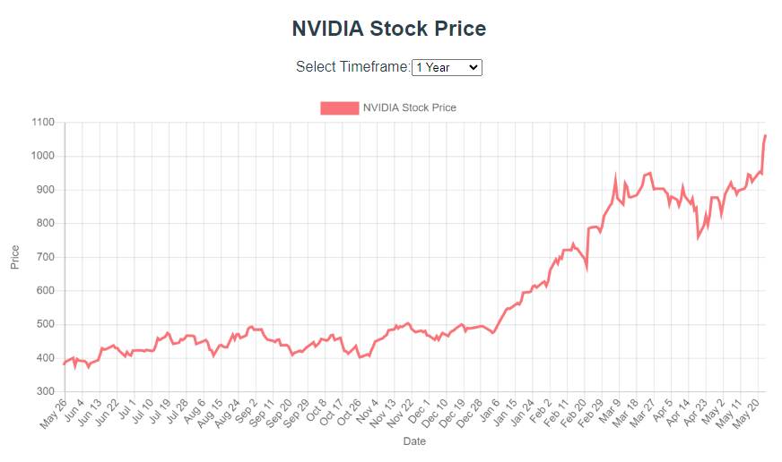

# NVIDIA Stock Analysis

This is a Vue.js application for analyzing NVIDIA stock data. The application fetches historical stock data from Yahoo Finance and displays it in an interactive line chart. Users can select different timeframes to view the stock data.

## Features

- Fetches historical stock data for NVIDIA from Yahoo Finance.
- Displays stock prices in an interactive line chart using Chart.js.
- Allows users to select different timeframes: 1 day, 1 week, 1 month, 3 months, 6 months, 1 year, 3 years, 5 years.
- Responsive design.

## Installation

To get started with this project, follow these steps:

1. **Clone the repository:**

   ```bash
   git clone https://github.com/rtfirst/nvidia-stock-analysis.git
   cd nvidia-stock-analysis
   ```

2. **Install dependencies:**

   Make sure you have [Node.js](https://nodejs.org/) installed. Then run:

   ```bash
   npm install
   ```

3. **Start the backend server:**

   The backend server fetches the stock data from Yahoo Finance.

   ```bash
   node server.js
   ```

4. **Start the Vue.js application:**

   In a new terminal, run:

   ```bash
   npm run serve
   ```

5. **Open the application in your browser:**

   Open your browser and navigate to `http://localhost:8080`.

## Project Structure

- `server.js`: Express.js server that fetches NVIDIA stock data from Yahoo Finance and serves it through an API endpoint.
- `src/main.js`: Entry point for the Vue.js application.
- `src/App.vue`: Root component of the Vue.js application.
- `src/components/StockChart.vue`: Component that displays the stock chart and allows the user to select different timeframes.

## API Endpoint

### GET /nvidia-stock

Fetches historical stock data for NVIDIA from Yahoo Finance.

**Response:**

```json
[
  {
    "date": "2023-05-01",
    "open": "280.00",
    "high": "285.00",
    "low": "275.00",
    "close": "282.00",
    "adjClose": "282.00",
    "volume": "3000000"
  },
  ...
]
```

## Screenshots



## Acknowledgements

- [Vue.js](https://vuejs.org/)
- [Chart.js](https://www.chartjs.org/)
- [Axios](https://github.com/axios/axios)
- [Yahoo Finance](https://finance.yahoo.com/)
